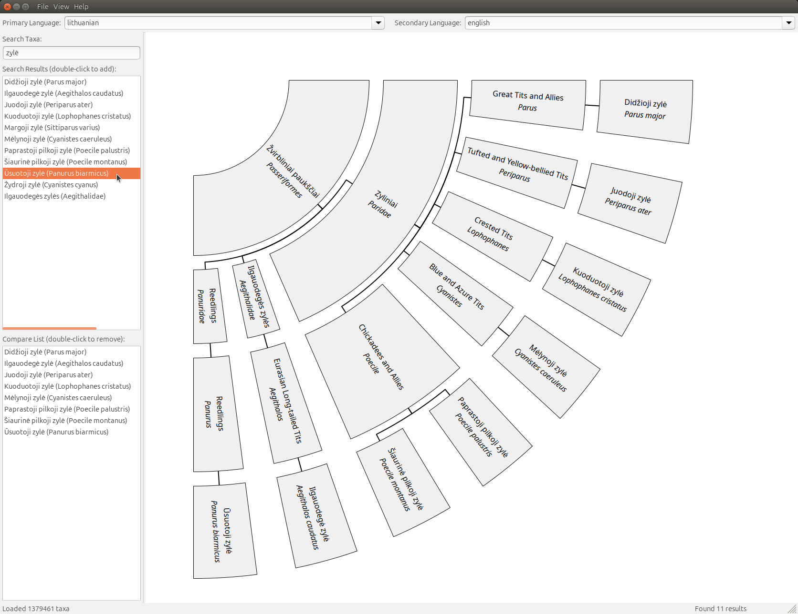

# TaxonomyTools

A suite of desktop applications for working with iNaturalist taxonomy data. This project includes two powerful tools:

- **TaxonomyDict**: Generate translation dictionaries from taxonomy data in TSV and StarDict formats
- **TaxonomyTree**: Visualize and compare taxonomic relationships with interactive family tree diagrams

## 🤖 AI-Generated Project

**This project was intentionally generated entirely by Claude AI with zero human code editing.** This was created as a learning exercise to explore the capabilities of AI-assisted software development and to demonstrate how complex, fully-functional applications can be built through AI collaboration.

### Project Genesis
- **100% AI-Generated Code**: Every line of code, from GUI layout to data processing algorithms
- **Zero Human Editing**: No manual code modifications were made by humans
- **Learning Path**: Developed as an exploration of Claude AI's software development capabilities
- **Modern C++ & wxWidgets**: Demonstrates AI's ability to work with complex frameworks and libraries

This project serves as a case study in AI-human collaboration for software development, showcasing what's possible when leveraging AI tools effectively.

## Features

### TaxonomyDict - Dictionary Generator
- **Download & Process**: Automatically download and extract iNaturalist taxonomy data
- **Multi-Language Support**: Generate dictionaries between any supported languages
- **Scientific Names**: Include scientific nomenclature in translations
- **Multiple Output Formats**: Export as TSV (tab-separated) or StarDict dictionary files
- **Language Information**: Translations include source language tags in italics for clarity
- **Advanced Filtering**: Filter entries to include only terms with target language translations
- **Progress Tracking**: Real-time progress indicators for all operations
- **User-Friendly Interface**: Clean, intuitive GUI with search functionality

### TaxonomyTree - Family Tree Visualizer
- **Interactive Visualization**: Display taxonomic relationships in fan, vertical, or horizontal tree layouts
- **Species Comparison**: Add multiple species to compare their evolutionary relationships
- **Multi-Language Display**: View taxa names in primary and secondary languages simultaneously
- **Common Ancestor Analysis**: Automatically find and display common ancestors of selected species
- **Full Tree Mode**: Option to show complete taxonomic tree up to kingdom level
- **Export Capabilities**: Save trees as SVG vector graphics or high-resolution PNG images
- **Zoom & Pan**: Smooth zoom controls and drag-to-pan navigation
- **Search Functionality**: Quick incremental search across all taxa in selected languages

## Screenshots

### TaxonomyDict Interface


The main application window showing the intuitive interface with language selection, filtering options, and progress tracking.

### Dictionary in Action


Example of a generated StarDict dictionary being used in GoldenDict, showing formatted translations with language tags and scientific names.

### TaxonomyTree Interface


Interactive taxonomic family tree viewer showing species relationships with multi-language support and various layout options.

## System Requirements

- **Operating System**: 
  - **Linux** (Ubuntu 20.04+ recommended) - *Built and tested*
  - **Windows** - *Cross-platform ready but untested by developer*
- **Dependencies**:
  - wxWidgets 3.0+
  - libcurl4-openssl-dev (Linux) / libcurl (Windows)
  - libzip-dev (Linux) / libzip (Windows)
  - CMake 3.10+
  - GCC with C++20 support (Linux) / MSVC 2019+ (Windows)

## Installation

**Note**: This project has been built and tested exclusively on Linux. While the codebase uses cross-platform libraries (wxWidgets, libcurl, libzip) and should be compatible with Windows, it has not been tested on Windows by the developer.

### Dependencies (Ubuntu/Debian)
```bash
sudo apt update
sudo apt install build-essential cmake
sudo apt install libwxgtk3.0-gtk3-dev libcurl4-openssl-dev libzip-dev
```

### Building from Source
```bash
git clone <repository-url>
cd TaxonomyTools
mkdir build && cd build
cmake ..
make
```

This will build both applications.

### Running the Applications
```bash
# Launch the dictionary generator
./build/TaxonomyDict

# Launch the tree visualizer
./build/TaxonomyTree
```

You can also build individual applications:
```bash
# Build only TaxonomyDict
cmake -DBUILD_TAXONOMY_TREE=OFF ..
make

# Build only TaxonomyTree
cmake -DBUILD_TAXONOMY_DICT=OFF ..
make
```

## User Guide

## TaxonomyDict User Guide

### 1. Getting Started

#### Download Taxonomy Data
1. **Enter Data URL**: Paste the iNaturalist taxonomy data URL in the download field
   - Default URL: `https://www.inaturalist.org/taxa/inaturalist-taxonomy.zip`
2. **Click "Download"**: Choose where to save the ZIP file
3. **Wait for Download**: Progress bar shows download status
4. **Load Archive**: Use "Load Existing Archive" to process the downloaded file

#### Load Existing Archive
- **Click "Load Existing Archive"**: Browse and select a previously downloaded taxonomy ZIP file
- **Processing**: The application extracts and indexes the taxonomy data
- **Language Detection**: Available languages are automatically detected and populated

### 2. Dictionary Configuration

#### Source Language Selection
- **Choose Source Language**: Select from the dropdown list of available languages
- **Scientific Names**: Use "Scientific Name" as source for scientific → vernacular dictionaries
- **Search Functionality**: Type to quickly find languages in the list

#### Target Languages Selection
- **Multiple Selection**: Check one or more target languages from the list
- **Search Support**: Type to filter and find languages quickly
- **Mix and Match**: Combine multiple vernacular languages with scientific names

#### Advanced Options
- **Include Scientific Names**: ☑️ Add scientific nomenclature to all entries
- **Filter Only Targets**: ☑️ Include only terms that have translations in selected target languages
  - *Unchecked*: Include all source terms (some may only have scientific names)
  - *Checked*: Include only terms with actual target language translations

### 3. Dictionary Generation

#### Output Configuration
1. **Set Output Directory**: Click "Browse" to choose where dictionaries will be saved
2. **File Naming**: Files are automatically named as `taxonomy_[source-language]_dictionary`

#### Generate Dictionary
1. **Click "Generate Dictionary"**: Starts the generation process
2. **Progress Tracking**: Monitor progress through the status bar and progress indicator
3. **Output Files**: Two formats are generated simultaneously:
   - **TSV File**: `taxonomy_[source]_dictionary.tsv` - Tab-separated format
   - **StarDict Files**: `.dict`, `.idx`, `.ifo` - StarDict dictionary format

### 4. Dictionary Formats

#### TSV Format
- **Structure**: `Source Term[TAB]Translations`
- **Translations**: Multiple translations separated by `<br>` tags
- **Language Tags**: Each translation includes language in italics: `translation <i>(language)</i>`
- **URLs**: Reference URLs separated with double line breaks for visual clarity

#### StarDict Format
- **Compatible**: Works with StarDict, GoldenDict, and other dictionary applications
- **Metadata**: Includes source/target language information in dictionary properties
- **HTML Formatting**: Supports rich text formatting with language tags

### 5. Example Usage Scenarios

#### English → Multiple Languages
- **Source**: English
- **Targets**: Spanish, French, German
- **Include Scientific**: ☑️
- **Result**: English terms with translations in all selected languages plus scientific names

#### Scientific → Vernacular
- **Source**: Scientific Name
- **Targets**: English, Spanish
- **Filter Only Targets**: ☑️
- **Result**: Only scientific names that have vernacular translations in English or Spanish

#### Comprehensive Dictionary
- **Source**: English
- **Targets**: All available languages
- **Include Scientific**: ☑️
- **Filter Only Targets**: ☐
- **Result**: Complete dictionary with all available translations

### 6. Language Information Display

Translations are formatted with clear language indicators:
- **Format**: `translation <i>(language)</i>`
- **Example**: `Wolf <i>(English)</i>, Lobo <i>(Spanish)</i>, Loup <i>(French)</i>`
- **Scientific Names**: Clearly marked as `<i>(Scientific Name)</i>`
- **URLs**: Separated for easy identification of reference links

### 7. Performance Tips

- **Large Datasets**: Processing complete taxonomy data may take several minutes
- **Filtered Results**: Use "Filter Only Targets" for faster processing and smaller files
- **Language Selection**: Limit target languages for faster generation if not all are needed
- **Progress Monitoring**: All operations show real-time progress and can be monitored

### 8. File Management

#### Generated Files
- **TSV**: Human-readable, spreadsheet-compatible format
- **StarDict**: Professional dictionary application format
- **Metadata**: Dictionary properties include language information and generation date

#### File Locations
- **Default Output**: User-selected directory
- **Naming Convention**: Consistent naming based on source language
- **File Sizes**: Vary based on language coverage and filtering options

---

## TaxonomyTree User Guide

### 1. Getting Started

#### Download or Load Taxonomy Data
1. **Download Data**: Use File → Download Taxonomy Data (Ctrl+D)
   - Downloads the latest iNaturalist taxonomy archive
   - Shows progress during download
2. **Load Archive**: Use File → Load Archive (Ctrl+O)
   - Browse and select a taxonomy ZIP file
   - Wait for processing and language detection

### 2. Language Configuration

#### Primary Language Selection
- **Choose Primary**: Select the main display language from the dropdown
- **Autocomplete**: Type to quickly find languages
- **Search Index**: Changes rebuild the search index for the selected language

#### Secondary Language (Optional)
- **Add Secondary**: Select an additional language for bilingual display
- **None Option**: Select "(None)" to show only primary language
- **Dual Display**: Both languages appear on tree nodes when secondary is selected

### 3. Finding and Adding Species

#### Search Taxa
1. **Type Search Term**: Enter at least 3 characters in the search box
2. **View Results**: Search results appear automatically with scientific names in parentheses
3. **Add to Compare List**: Double-click any result to add it to the comparison list

#### Compare List Management
- **View Selected**: All selected species appear in the compare list
- **Remove Species**: Double-click any item in the compare list to remove it
- **Clear All**: Click "Clear List" button to remove all species at once

### 4. Tree Visualization

#### Layout Options
- **Fan Layout** (Ctrl+1): Circular/radial tree spreading from center
- **Vertical Layout** (Ctrl+2): Traditional top-to-bottom tree
- **Horizontal Layout** (Ctrl+3): Left-to-right tree layout

#### Display Options
- **Show Boxes** (Ctrl+B): Toggle rectangular boxes around node labels
- **Show Full Tree** (Ctrl+F): Display complete ancestry up to kingdom level
  - *Unchecked*: Shows only common ancestor relationships
  - *Checked*: Extends tree to include all taxonomic levels to kingdom

#### Navigation Controls
- **Zoom In** (Ctrl+= or Ctrl+Numpad+): Increase tree size
- **Zoom Out** (Ctrl+- or Ctrl+Numpad-): Decrease tree size
- **Reset Zoom** (Ctrl+0 or Ctrl+Numpad0): Return to 100% zoom
- **Mouse Wheel**: Hold Ctrl and scroll to zoom
- **Drag to Pan**: Click and drag to move the tree view
- **Scroll Bars**: Use scrollbars for precise navigation

### 5. Exporting Trees

#### Export to SVG
1. **Select**: File → Export to SVG (Ctrl+S) (**NOTE:** Fan layout cannot be exported to SVG, it reverts to 300 dpi PNG)
2. **Choose Location**: Select save location and filename
3. **Vector Format**: Produces scalable vector graphics perfect for publications

#### Export to PNG
1. **Select**: File → Export to PNG (Ctrl+P)
2. **Set DPI**: Enter desired resolution (70-600 DPI)
   - 150 DPI: Standard screen resolution
   - 300 DPI: Print quality
   - 600 DPI: High-quality publications
3. **Raster Format**: Produces pixel-based images at specified resolution

### 6. Understanding the Tree Display

#### Node Information
- **Primary Name**: Displayed in the selected primary language
- **Secondary Name**: Shown below in secondary language (if selected)
- **Scientific Names**: Always available when hovering or in scientific name mode
- **Taxonomic Rank**: Indicated by node position and styling

#### Tree Structure
- **Common Ancestors**: Automatically calculated and displayed
- **Branch Lines**: Connect related taxa showing evolutionary relationships
- **Terminal Nodes**: Selected species appear at the tree endpoints
- **Internal Nodes**: Common ancestors and intermediate taxonomic ranks

### 7. Example Usage Scenarios

#### Compare Similar Species
- **Purpose**: Understand how closely related different species are
- **Example**: Compare Wolf, Dog, Fox to see Canidae family relationships
- **Result**: Visual tree showing common ancestors and divergence points

#### Multi-Language Learning
- **Purpose**: Learn species names in multiple languages
- **Example**: Primary=English, Secondary=Spanish
- **Result**: See both English and Spanish names on all nodes

#### Full Taxonomic Context
- **Purpose**: Understand complete classification hierarchy
- **Example**: Add any species, enable "Show Full Tree"
- **Result**: Complete tree from Kingdom to Species

#### Publication Graphics
- **Purpose**: Create high-quality figures for papers
- **Example**: Configure tree, export as SVG at high DPI
- **Result**: Publication-ready vector graphics with perfect scaling

### 8. Performance Tips

- **Language Indexing**: Initial language selection may take a few seconds for large datasets
- **Search Response**: Search results appear with slight delay for smooth typing
- **Tree Complexity**: More species = more complex tree calculations
- **Export Quality**: Higher DPI = larger file sizes and longer export times
- **Full Tree Mode**: Enabling full tree significantly increases tree size and complexity

### 9. Keyboard Shortcuts

#### File Operations
- **Ctrl+D**: Download taxonomy data
- **Ctrl+O**: Load archive
- **Ctrl+S**: Export to SVG
- **Ctrl+P**: Export to PNG
- **Ctrl+Q**: Exit application

#### View Controls
- **Ctrl+1**: Fan layout
- **Ctrl+2**: Vertical layout
- **Ctrl+3**: Horizontal layout
- **Ctrl+B**: Toggle boxes
- **Ctrl+F**: Toggle full tree

#### Zoom Controls
- **Ctrl+=**: Zoom in
- **Ctrl+-**: Zoom out
- **Ctrl+0**: Reset zoom
- **Ctrl+Wheel**: Smooth zoom

---

## Technical Details

### Architecture

#### Common Components
- **GUI Framework**: wxWidgets for cross-platform desktop interface
- **Threading**: Multi-threaded design for responsive UI during operations
- **Data Processing**: CSV parsing with efficient memory management
- **Network**: libcurl for reliable data downloading
- **Compression**: libzip for archive handling

#### TaxonomyDict Specifics
- **Dictionary Formats**: TSV and StarDict generation engines
- **Text Processing**: HTML markup and formatting for rich text display
- **Multi-target Support**: Efficient handling of multiple target languages

#### TaxonomyTree Specifics
- **Tree Algorithms**: Efficient common ancestor finding and tree construction
- **Search Indexing**: Fast multi-language search with autocomplete
- **Rendering Engine**: Custom vector graphics rendering for tree layouts
- **Export Formats**: SVG vector and PNG raster image generation
- **Zoom & Pan**: Smooth interactive navigation with hardware acceleration

### Data Sources
- **Primary**: iNaturalist taxonomy database
- **Format**: CSV files within ZIP archives
- **Languages**: 50+ supported vernacular languages
- **Coverage**: Comprehensive taxonomic data across biological kingdoms

### Dictionary Quality
- **Source Accuracy**: Data sourced from iNaturalist's curated taxonomy
- **Language Tags**: Clear identification of translation languages
- **Reference Links**: Direct links to iNaturalist species pages
- **Formatting**: HTML-compatible markup for rich text display

## Contributing

As this is an AI-generated project showcasing Claude AI capabilities, contributions should focus on:
- Testing and bug reports
- Documentation improvements
- Feature suggestions
- Use case examples

## License

This project is licensed under the MIT License - see the [LICENSE](LICENSE) file for details.

This unique project demonstrates AI-generated software capabilities through AI-human collaboration:
- **AI Prompting & Direction**: Darau, Blė
- **Icon Design**: Darau, Blė
- **Code Generation & Implementation**: Claude AI (Anthropic)

## Acknowledgments

- **iNaturalist**: For providing comprehensive taxonomy data
- **Claude AI**: For generating 90% of the codebase
- **wxWidgets Community**: For the excellent cross-platform GUI framework
- **Open Source Community**: For the foundational libraries used

---

*This README and 90% of the project were generated by Claude AI as part of an exploration into AI-assisted software development capabilities.*

**Copyright to AI prompting**: Darau, Blė.