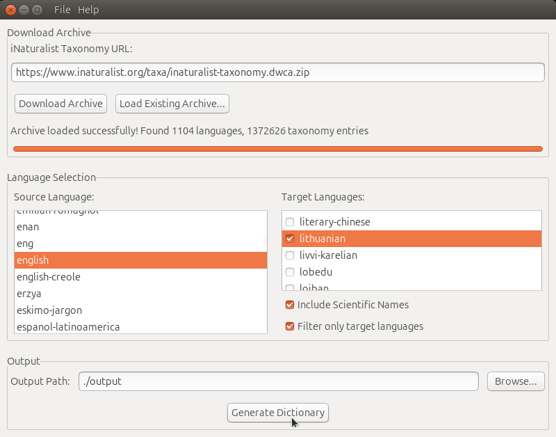
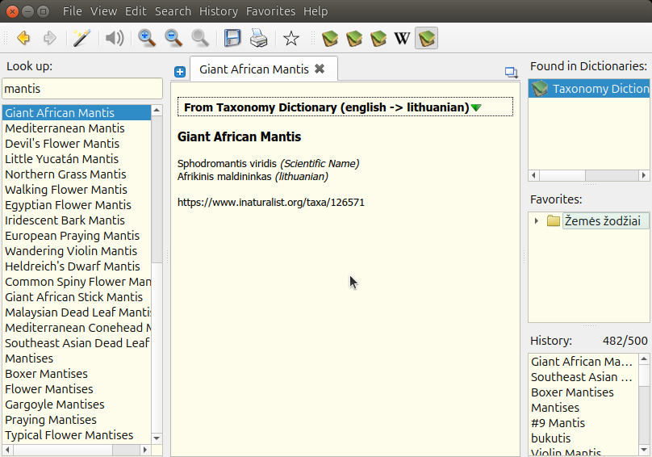

# Taxonomy Dictionary Generator

A desktop application for generating translation dictionaries from iNaturalist taxonomy data, supporting both TSV and StarDict formats.

## 🤖 AI-Generated Project

**This project was intentionally generated entirely by Claude AI with zero human code editing.** This was created as a learning exercise to explore the capabilities of AI-assisted software development and to demonstrate how complex, fully-functional applications can be built through AI collaboration.

### Project Genesis
- **100% AI-Generated Code**: Every line of code, from GUI layout to data processing algorithms
- **Zero Human Editing**: No manual code modifications were made by humans
- **Learning Path**: Developed as an exploration of Claude AI's software development capabilities
- **Modern C++ & wxWidgets**: Demonstrates AI's ability to work with complex frameworks and libraries

This project serves as a case study in AI-human collaboration for software development, showcasing what's possible when leveraging AI tools effectively.

## Features

- **Download & Process**: Automatically download and extract iNaturalist taxonomy data
- **Multi-Language Support**: Generate dictionaries between any supported languages
- **Scientific Names**: Include scientific nomenclature in translations
- **Multiple Output Formats**: Export as TSV (tab-separated) or StarDict dictionary files
- **Language Information**: Translations include source language tags in italics for clarity
- **Advanced Filtering**: Filter entries to include only terms with target language translations
- **Progress Tracking**: Real-time progress indicators for all operations
- **User-Friendly Interface**: Clean, intuitive GUI with search functionality

## Screenshots

### Application Interface


The main application window showing the intuitive interface with language selection, filtering options, and progress tracking.

### Dictionary in Action


Example of a generated StarDict dictionary being used in GoldenDict, showing formatted translations with language tags and scientific names.

## System Requirements

- **Operating System**: 
  - **Linux** (Ubuntu 20.04+ recommended) - *Built and tested*
  - **Windows** - *Cross-platform ready but untested by developer*
- **Dependencies**:
  - wxWidgets 3.0+
  - libcurl4-openssl-dev (Linux) / libcurl (Windows)
  - libzip-dev (Linux) / libzip (Windows)
  - CMake 3.10+
  - GCC with C++20 support (Linux) / MSVC 2019+ (Windows)

## Installation

**Note**: This project has been built and tested exclusively on Linux. While the codebase uses cross-platform libraries (wxWidgets, libcurl, libzip) and should be compatible with Windows, it has not been tested on Windows by the developer.

### Dependencies (Ubuntu/Debian)
```bash
sudo apt update
sudo apt install build-essential cmake
sudo apt install libwxgtk3.0-gtk3-dev libcurl4-openssl-dev libzip-dev
```

### Building from Source
```bash
git clone <repository-url>
cd Taxonomy-Dict
mkdir build && cd build
cmake ..
make
```

### Running the Application
```bash
./TaxonomyDict
```

## User Guide

### 1. Getting Started

#### Download Taxonomy Data
1. **Enter Data URL**: Paste the iNaturalist taxonomy data URL in the download field
   - Default URL: `https://www.inaturalist.org/taxa/inaturalist-taxonomy.zip`
2. **Click "Download"**: Choose where to save the ZIP file
3. **Wait for Download**: Progress bar shows download status
4. **Load Archive**: Use "Load Existing Archive" to process the downloaded file

#### Load Existing Archive
- **Click "Load Existing Archive"**: Browse and select a previously downloaded taxonomy ZIP file
- **Processing**: The application extracts and indexes the taxonomy data
- **Language Detection**: Available languages are automatically detected and populated

### 2. Dictionary Configuration

#### Source Language Selection
- **Choose Source Language**: Select from the dropdown list of available languages
- **Scientific Names**: Use "Scientific Name" as source for scientific → vernacular dictionaries
- **Search Functionality**: Type to quickly find languages in the list

#### Target Languages Selection
- **Multiple Selection**: Check one or more target languages from the list
- **Search Support**: Type to filter and find languages quickly
- **Mix and Match**: Combine multiple vernacular languages with scientific names

#### Advanced Options
- **Include Scientific Names**: ☑️ Add scientific nomenclature to all entries
- **Filter Only Targets**: ☑️ Include only terms that have translations in selected target languages
  - *Unchecked*: Include all source terms (some may only have scientific names)
  - *Checked*: Include only terms with actual target language translations

### 3. Dictionary Generation

#### Output Configuration
1. **Set Output Directory**: Click "Browse" to choose where dictionaries will be saved
2. **File Naming**: Files are automatically named as `taxonomy_[source-language]_dictionary`

#### Generate Dictionary
1. **Click "Generate Dictionary"**: Starts the generation process
2. **Progress Tracking**: Monitor progress through the status bar and progress indicator
3. **Output Files**: Two formats are generated simultaneously:
   - **TSV File**: `taxonomy_[source]_dictionary.tsv` - Tab-separated format
   - **StarDict Files**: `.dict`, `.idx`, `.ifo` - StarDict dictionary format

### 4. Dictionary Formats

#### TSV Format
- **Structure**: `Source Term[TAB]Translations`
- **Translations**: Multiple translations separated by `<br>` tags
- **Language Tags**: Each translation includes language in italics: `translation <i>(language)</i>`
- **URLs**: Reference URLs separated with double line breaks for visual clarity

#### StarDict Format
- **Compatible**: Works with StarDict, GoldenDict, and other dictionary applications
- **Metadata**: Includes source/target language information in dictionary properties
- **HTML Formatting**: Supports rich text formatting with language tags

### 5. Example Usage Scenarios

#### English → Multiple Languages
- **Source**: English
- **Targets**: Spanish, French, German
- **Include Scientific**: ☑️
- **Result**: English terms with translations in all selected languages plus scientific names

#### Scientific → Vernacular
- **Source**: Scientific Name
- **Targets**: English, Spanish
- **Filter Only Targets**: ☑️
- **Result**: Only scientific names that have vernacular translations in English or Spanish

#### Comprehensive Dictionary
- **Source**: English
- **Targets**: All available languages
- **Include Scientific**: ☑️
- **Filter Only Targets**: ☐
- **Result**: Complete dictionary with all available translations

### 6. Language Information Display

Translations are formatted with clear language indicators:
- **Format**: `translation <i>(language)</i>`
- **Example**: `Wolf <i>(English)</i>, Lobo <i>(Spanish)</i>, Loup <i>(French)</i>`
- **Scientific Names**: Clearly marked as `<i>(Scientific Name)</i>`
- **URLs**: Separated for easy identification of reference links

### 7. Performance Tips

- **Large Datasets**: Processing complete taxonomy data may take several minutes
- **Filtered Results**: Use "Filter Only Targets" for faster processing and smaller files
- **Language Selection**: Limit target languages for faster generation if not all are needed
- **Progress Monitoring**: All operations show real-time progress and can be monitored

### 8. File Management

#### Generated Files
- **TSV**: Human-readable, spreadsheet-compatible format
- **StarDict**: Professional dictionary application format
- **Metadata**: Dictionary properties include language information and generation date

#### File Locations
- **Default Output**: User-selected directory
- **Naming Convention**: Consistent naming based on source language
- **File Sizes**: Vary based on language coverage and filtering options

## Technical Details

### Architecture
- **GUI Framework**: wxWidgets for cross-platform desktop interface
- **Threading**: Multi-threaded design for responsive UI during operations
- **Data Processing**: CSV parsing with efficient memory management
- **Network**: libcurl for reliable data downloading
- **Compression**: libzip for archive handling

### Data Sources
- **Primary**: iNaturalist taxonomy database
- **Format**: CSV files within ZIP archives
- **Languages**: 50+ supported vernacular languages
- **Coverage**: Comprehensive taxonomic data across biological kingdoms

### Dictionary Quality
- **Source Accuracy**: Data sourced from iNaturalist's curated taxonomy
- **Language Tags**: Clear identification of translation languages
- **Reference Links**: Direct links to iNaturalist species pages
- **Formatting**: HTML-compatible markup for rich text display

## Contributing

As this is an AI-generated project showcasing Claude AI capabilities, contributions should focus on:
- Testing and bug reports
- Documentation improvements
- Feature suggestions
- Use case examples

## License

This project is licensed under the MIT License - see the [LICENSE](LICENSE) file for details.

This unique project demonstrates AI-generated software capabilities through AI-human collaboration:
- **AI Prompting & Direction**: Darau, Blė
- **Code Generation & Implementation**: Claude AI (Anthropic)

## Acknowledgments

- **iNaturalist**: For providing comprehensive taxonomy data
- **Claude AI**: For generating the entire codebase
- **wxWidgets Community**: For the excellent cross-platform GUI framework
- **Open Source Community**: For the foundational libraries used

---

*This README and the entire project were generated by Claude AI as part of an exploration into AI-assisted software development capabilities.*

**Copyright to AI prompting**: Darau, Blė.